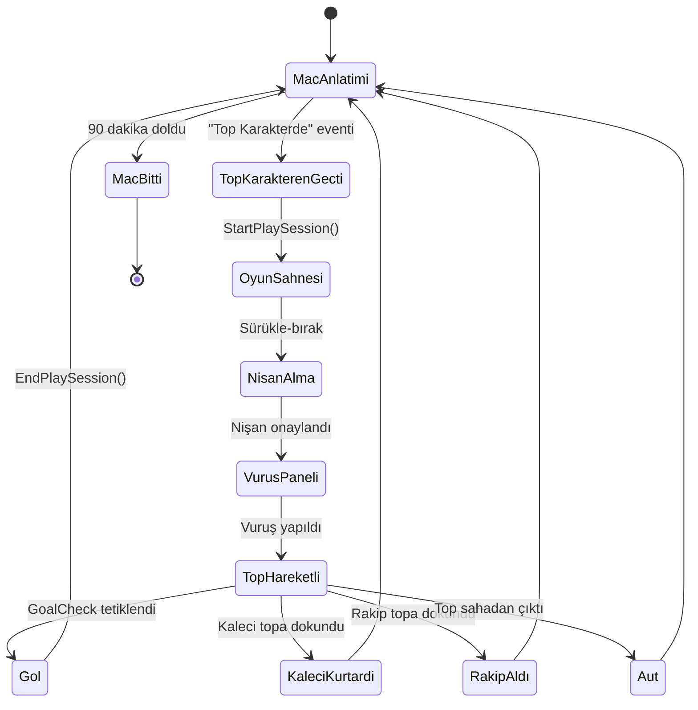

Youtube => https://youtu.be/5M0nsGN0Rts

# ⚽ New Star Soccer - Unity Demo

New Star Soccer oyununun Unity ile yapılmış bir demosudur. 2D futbol mekaniği, top fiziği, AI oyuncular ve maç simülasyonu içerir.


---

## 🎮 Özellikler

- **Gerçekçi Top Fiziği**: Falso, havalanma, yerçekimi simülasyonu
- **Slingshot Atış Sistemi**: Sürükle-bırak nişan alma ve vuruş noktası seçimi
- **AI Oyuncular**: Kaleci, takım arkadaşları ve rakipler
- **Maç Simülasyonu**: Canlı maç anlatımı ve skor takibi
- **İstatistik Sistemi**: Gol, asist, pas ve top kaybı takibi

---

## 📁 Script Yapısı

### 🔵 Çekirdek Sistemler

| Script | Açıklama |
|--------|----------|
| [`MatchManager.cs`](Assets/Scripts/MatchManager.cs) | Merkezi oyun yöneticisi. Skor, zaman, maç durumu ve olay yönetimi |
| [`GameSpawner.cs`](Assets/Scripts/GameSpawner.cs) | Oyuncuları rastgele pozisyonlarda spawn eder |
| [`ShootingManager.cs`](Assets/Scripts/ShootingManager.cs) | Sürükle-bırak nişan alma ve vuruş noktası seçimi |

### ⚽ Top Sistemi

| Script | Açıklama |
|--------|----------|
| [`BallPhysics.cs`](Assets/Scripts/BallPhysics.cs) | Top fiziği: Falso, yerçekimi, yükseklik, gölge |
| [`BallController.cs`](Assets/Scripts/BallController.cs) | Basit top kontrolü (alternatif input sistemi) |

### 🤖 AI Sistemleri

| Script | Açıklama |
|--------|----------|
| [`GoalkeeperAI.cs`](Assets/Scripts/GoalkeeperAI.cs) | Kaleci AI: Patrol, atlama, top kurtarma |
| [`TeammateAI.cs`](Assets/Scripts/TeammateAI.cs) | Takım arkadaşı AI: Topu kovalar, şut çeker (asist sistemi) |
| [`OpponentAI.cs`](Assets/Scripts/OpponentAI.cs) | Rakip AI: Topu kovalar, top çalar |

### 🎯 Tetikleyiciler

| Script | Açıklama |
|--------|----------|
| [`GoalCheck.cs`](Assets/Scripts/GoalCheck.cs) | Kale çizgisi tetikleyicisi, gol algılama |

### 📜 UI Sistemleri

| Script | Açıklama |
|--------|----------|
| [`ScrollViewPopulator.cs`](Assets/Scripts/ScrollViewPopulator.cs) | Maç anlatımı, olay spawn'lama, otomatik kaydırma |
| [`ScrollViewItem.cs`](Assets/Scripts/ScrollViewItem.cs) | Tek bir maç olayı UI elemanı |

---

## 🏗️ Mimari

```
MatchManager (Singleton)
    ├── ScrollViewPopulator (Maç Anlatımı)
    ├── GameSpawner (Oyuncu Spawn)
    ├── ShootingManager (Atış Kontrolü)
    └── BallPhysics (Top Fiziği)
            ├── GoalkeeperAI
            ├── TeammateAI
            └── OpponentAI
```

---

## 🎮 Oyun Akışı



---

## ⚙️ Ayarlanabilir Parametreler

### BallPhysics
| Parametre | Varsayılan | Açıklama |
|-----------|------------|----------|
| `gravity` | 30 | Yerçekimi kuvveti |
| `curveStrength` | 40 | Falso etkisi |
| `friction` | 1.5 | Sürtünme |
| `crossbarHeight` | 2.44 | Kale direği yüksekliği |

### ShootingManager
| Parametre | Varsayılan | Açıklama |
|-----------|------------|----------|
| `maxPower` | 30 | Maksimum şut gücü |
| `loftMultiplier` | 15 | Havalanma çarpanı |
| `imageMovementSpeed` | 250 | Vuruş paneli hızı |

### GoalkeeperAI
| Parametre | Varsayılan | Açıklama |
|-----------|------------|----------|
| `patrolSpeed` | 3 | Pozisyon alma hızı |
| `diveSpeed` | 12 | Atlama hızı |
| `diveTriggerDistance` | 7 | Atlama tetikleme mesafesi |
| `patrolAreaHeight` | 5 | Dikey hareket alanı |

### ScrollViewPopulator
| Parametre | Varsayılan | Açıklama |
|-----------|------------|----------|
| `spawnInterval` | 1 | Olay spawn aralığı (saniye) |
| `goalChance` | 5 | Gol olayı olasılığı (%) |
| `actionChance` | 30 | "Top Karakterde" olasılığı (%) |

---

## 📊 İstatistik Sistemi

MatchManager aşağıdaki istatistikleri takip eder:

| İstatistik | Açıklama |
|------------|----------|
| `ourTeamScore` | Takımımızın gol sayısı |
| `opponentTeamScore` | Rakip takımın gol sayısı |
| `starPlayerGoals` | Yıldız oyuncunun attığı goller |
| `starPlayerAssists` | Yıldız oyuncunun asistleri |
| `starPlayerPass` | Toplam pas sayısı |
| `starPlayerLostBall` | Top kaybı sayısı |

---

## 🏷️ Gerekli Tag'ler

Unity Editor'da aşağıdaki tag'lerin tanımlı olduğundan emin olun:

- `Ball` - Top objesi
- `GoalPost` - Kale objesi
- `Aut` - Saha dışı tetikleyicileri

---

## 🚀 Kurulum

1. Unity 2022.3+ ile projeyi açın
2. TextMeshPro paketinin yüklü olduğundan emin olun
3. `Assets/Scenes` klasöründen ana sahneyi açın
4. Play tuşuna basın

---

## 📝 Lisans

Bu proje eğitim amaçlı geliştirilmiştir.

---

## 🤝 Katkıda Bulunma

1. Bu repository'yi fork edin
2. Feature branch oluşturun (`git checkout -b feature/YeniOzellik`)
3. Değişikliklerinizi commit edin (`git commit -m 'Yeni özellik eklendi'`)
4. Branch'i push edin (`git push origin feature/YeniOzellik`)
5. Pull Request açın
